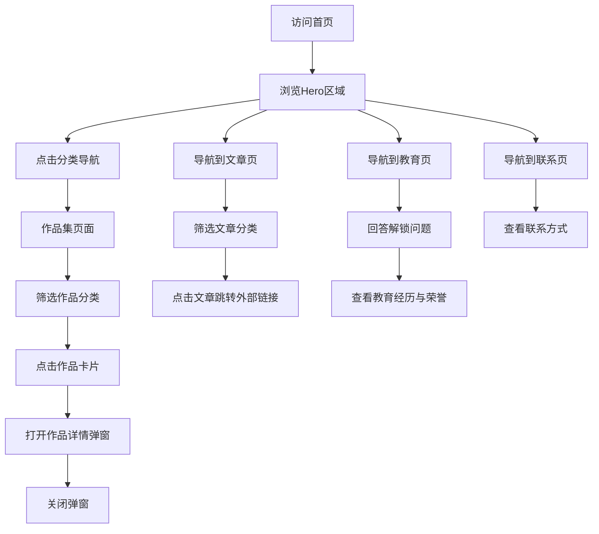

# LuN3cy 个人网站 - 产品需求文档

## 1. 产品概述

复刻 `https://lun3cy.top/` 个人网站，用于展示个人信息、作品集、文章等内容。整体风格、布局、交互效果与原网站1:1一致，仅作品集和文章模块的内容可自行拟写。

- **目标用户**: 潜在雇主、合作伙伴、同行创作者
- **核心价值**: 通过高质量的视觉设计展示个人作品与能力，建立专业形象

## 2. 核心功能

### 2.1 页面模块

| 页面 | 模块 | 功能描述 |
|------|------|----------|
| 首页 (Dashboard) | Hero区域 | 大标题个人介绍、可点击分类导航 |
| 首页 (Dashboard) | 精选作品预览 | 展示最新/精选作品集 |
| 作品集 (Portfolio) | 分类筛选 | 全部/静态摄影/动态影像/平面交互/应用开发 |
| 作品集 (Portfolio) | 作品网格 | 响应式卡片网格布局 |
| 作品集 (Portfolio) | 作品详情弹窗 | 大图/视频/Figma预览、项目信息 |
| 文章 (Articles) | 分类侧边栏 | 文章分类筛选 |
| 文章 (Articles) | 文章列表 | 卡片式文章列表，支持排序 |
| 教育 (About) | 时间线 | 教育经历与工作经历 |
| 教育 (About) | 荣誉弹窗 | 奖学金、称号、竞赛奖项 |
| 联系 (Contact) | 联系方式网格 | 邮箱、公众号、小红书、B站、500px、GitHub |

### 2.2 全局功能

- **多语言切换**: 中文/英文
- **明暗主题**: 自动根据时间(18:30-06:00暗色) + 手动切换
- **重力爆炸效果**: 点击炸弹图标触发 Matter.js 物理引擎动画
- **音乐播放器**: 右下角浮动音乐播放器
- **View Transition**: 页面切换动画

## 3. 核心流程

## 4. 用户界面设计

### 4.1 设计规范

- **主色调**: 黑白高对比 (`#000000` / `#ffffff`)
- **辅助色**: 灰色系 (`#666666`, `#e5e5e5`, `#f5f5f5`)
- **强调色**: 
  - 绿色 `#00D26A` (联系按钮)
  - 橙色 `#f97316` (邮箱hover)
  - 微信绿 `#07C160`
  - 小红书红 `#EC4048`
  - B站蓝 `#00AEEC`
- **字体**: OPPO Sans, Inter, PingFang SC, Microsoft YaHei
- **圆角**: `2rem` (32px) 大圆角为主
- **阴影**: 极简，仅卡片hover时轻微阴影

### 4.2 布局规范

- **最大宽度**: `96vw`
- **导航栏**: 固定顶部，滚动后变胶囊形
- **Hero区域**: 12列网格，左侧7列标题+介绍，右侧5列信息列表
- **作品集网格**: 
  - 全部: 4列
  - 筛选后: 3列
- **文章布局**: 左侧边栏(分类) + 右侧内容区

### 4.3 动画规范

- **页面加载**: `fadeIn` 0.8s ease-out
- **页面切换**: View Transition API, 0.25s fadeOut + 0.35s fadeIn
- **弹窗进入**: `messagePop` - 从模糊缩放到清晰
- **弹窗退出**: `messagePopOut` - 模糊缩小消失
- **Hover效果**: 
  - 卡片: `translateY(-8px)` + 阴影
  - 图片: `scale(1.05)`
  - 按钮: `scale(1.02)`
- **导航栏滚动**: 0.7s cubic-bezier 过渡

### 4.4 响应式断点

- **桌面**: > 1024px (lg)
- **平板**: 768px - 1024px (md)
- **手机**: < 768px

## 5. 技术架构

- **框架**: React 19 + TypeScript
- **构建工具**: Vite 6
- **样式**: Tailwind CSS 3.4
- **物理引擎**: Matter.js (重力爆炸效果)
- **图标**: Lucide React
- **状态管理**: React useState (无需全局状态库)
