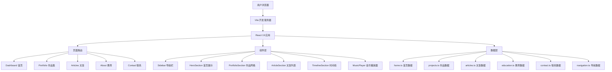

# LuN3cy 个人网站 - 技术架构文档

## 1. 架构设计



## 2. 技术栈

| 层级 | 技术 | 版本 | 用途 |
|------|------|------|------|
| 前端框架 | React | ^19.2.0 | UI渲染 |
| 语言 | TypeScript | ~5.8.2 | 类型安全 |
| 构建工具 | Vite | ^6.2.0 | 开发服务器与打包 |
| 样式 | Tailwind CSS | ^3.4.17 | 原子化CSS |
| 物理引擎 | Matter.js | ^0.20.0 | 重力爆炸效果 |
| 图标 | Lucide React | ^0.555.0 | 矢量图标 |
| 动画 | CSS Keyframes | - | 页面过渡与微交互 |

## 3. 项目结构

```
/workspace/
├── index.html              # 入口HTML
├── index.tsx               # React入口
├── App.tsx                 # 根组件（路由与状态管理）
├── index.css               # 全局样式与Tailwind指令
├── types.ts                # TypeScript类型定义
├── constants.ts            # 常量与数据聚合
├── tailwind.config.js      # Tailwind配置
├── vite.config.ts          # Vite配置
├── tsconfig.json           # TypeScript配置
├── components/             # React组件
│   ├── Sidebar.tsx         # 导航栏
│   ├── HeroSection.tsx     # 首页Hero区域
│   ├── PortfolioSection.tsx # 作品集网格与弹窗
│   ├── ArticleSection.tsx  # 文章列表
│   ├── TimelineSection.tsx # 教育时间线与荣誉弹窗
│   ├── MusicPlayer.tsx     # 音乐播放器
│   ├── ElasticSlider.tsx   # 弹性滑块组件
│   └── SoftCard.tsx        # 柔和卡片组件
├── src/data/               # 数据文件
│   ├── home.ts             # 首页内容
│   ├── navigation.ts       # 导航项
│   ├── contact.ts          # 联系信息
│   ├── articles.ts         # 文章数据
│   ├── projects.ts         # 项目聚合
│   ├── photography_projects.ts # 摄影项目
│   ├── videography.ts      # 视频项目
│   ├── design.ts           # 设计项目
│   ├── dev.ts              # 开发项目
│   ├── education.ts        # 教育经历
│   ├── photography.ts      # 摄影图库
│   └── music.ts            # 音乐数据
└── public/                 # 静态资源
    ├── logo.svg            # 网站Logo
    └── music/              # 音乐文件
```

## 4. 状态管理

采用 React 原生 useState 进行状态管理：

| 状态 | 类型 | 说明 |
|------|------|------|
| activeTab | string | 当前页面标签 |
| language | 'zh' \| 'en' | 当前语言 |
| theme | 'light' \| 'dark' | 当前主题 |
| portfolioCategory | string | 作品筛选分类 |
| gravityActive | boolean | 重力爆炸是否激活 |
| selectedProject | Project \| null | 选中的作品 |
| selectedArticle | Article \| null | 选中的文章 |
| isModalOpen | boolean | 弹窗开关 |

## 5. 关键交互实现

### 5.1 View Transition 页面切换

```typescript
const startViewTransition = (update: () => void) => {
  if (window.innerWidth < 768) {
    update();
    return;
  }
  if (document.startViewTransition) {
    document.startViewTransition(update);
  } else {
    update();
  }
};
```

### 5.2 Matter.js 重力爆炸

- 使用 `matter-js` 创建物理引擎
- 将页面元素转换为物理刚体
- 添加地板和墙壁约束
- 点击时施加爆炸力
- 重置时恢复原始位置和样式

### 5.3 主题切换

- 根据时间自动判断（18:30 - 06:00 暗色）
- 手动切换通过 `document.documentElement.classList.add/remove('dark')`
- Tailwind `darkMode: 'class'` 配置

## 6. 响应式策略

- **Desktop-first** 设计
- 使用 Tailwind 响应式前缀：`md:`, `lg:`
- 移动端禁用 View Transition 防止闪烁
- 移动端导航栏保持横向滚动
